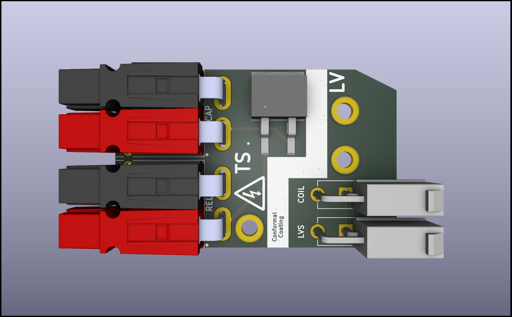

# Formula Student Electronics
Hardware projects for Formula Student UK competition 2024-25.

💻Github https://github.com/sebgothard/FS_Electronics

## [Precharge](Precharge)
A device to charge the tractive system such that the battery voltage doesn't damage the internals of the inverter.

The precharge module.

## [Discharge](Discharge)
A device to discharge the tractive system, specifically a capacitor in the inverter.

The discharge module.

